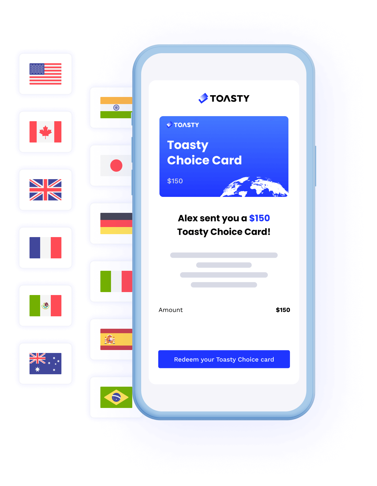
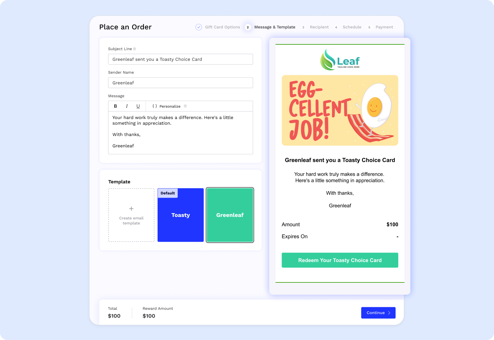
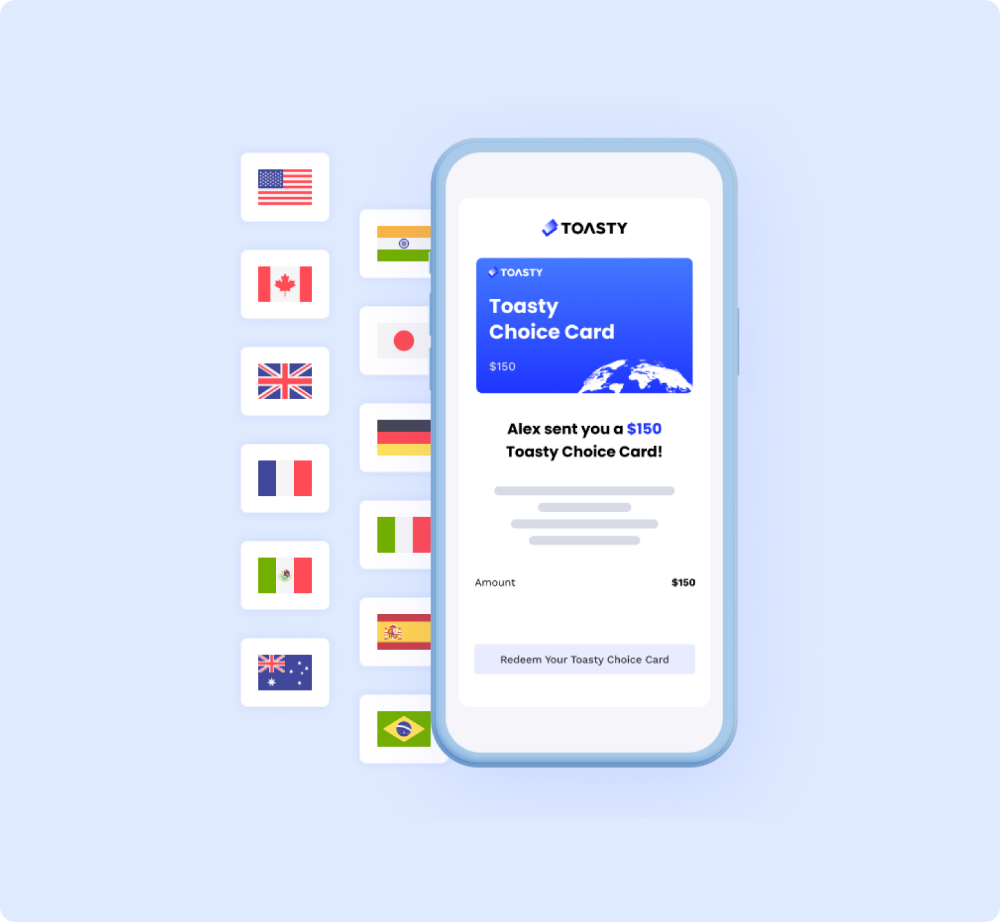
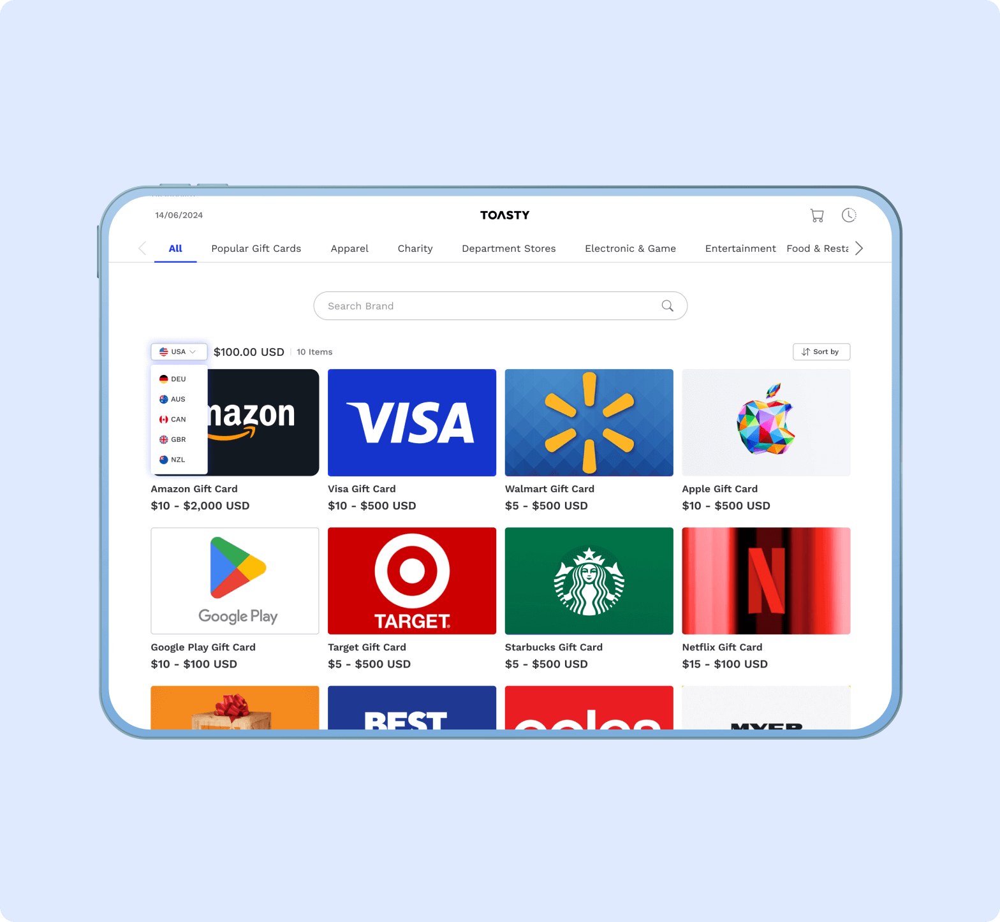

# How the Toasty Choice Card works

<figure><figcaption></figcaption></figure>

The Toasty Choice Card allows recipients to **select their preferred brands from** **thousands of options in their local currency**. This flexibility ensures a more personalized reward experience and eliminates the guesswork involved with traditional gift cards.


Want to see the list of brands and countries supported? Head over to our [Brand Catalog](https://www.toastycard.com/marketing/catalog?utm\_source=blog\&utm\_medium=bloglink\&utm\_content=gitbook) to learn more.


## Toasty Choice Cards in 3 Easy Steps

Sending Toasty Choice Cards is as easy as 1-2-3.

### 1: Customize Your Reward Email

<figure><figcaption></figcaption></figure>

Toasty allows you to make your reward emails your own by adding your logo, color scheme, and a personal message. You can even save your design as a template to save time on future orders.&#x20;


Utilize merge fields such as First Name and Last Name to give your rewards a more personal touch.


### 2. Recipient Redeems Their Toasty Choice Card

<figure><figcaption></figcaption></figure>

Your recipient will receive an email clearly guiding them through redeeming their Toasty Choice Card.&#x20;


Recipients simply need to click "Redeem Your Toasty Choice Card" from their email -- no account needed!


### 3. Recipients Choose Their Preferred Brands in Their Preferred Currency

<figure><figcaption></figcaption></figure>

Recipients will be taken to the redemption portal, where they will have the opportunity to select the gift cards they want. With thousands of options over 91 countries, there is bound to be something for everyone.&#x20;


Toasty Choice Cards can easily be split between multiple brands.


### Fees to Expect

**None.** Whether you are sending 1 card or thousands, you can expect a no-markup experience. We do not lock you into a subscription, do not charge per card, and have no hidden fees.&#x20;
